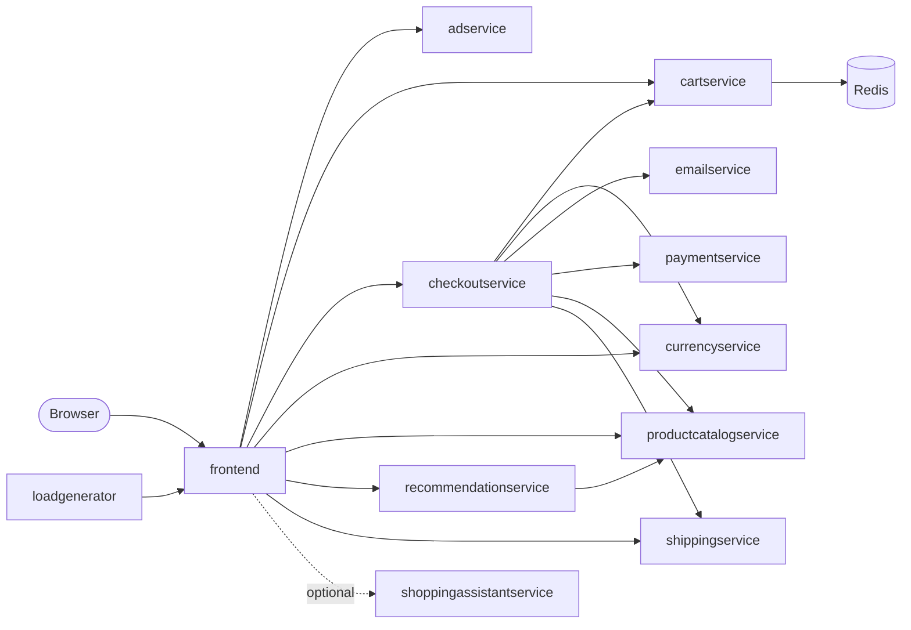

# E-Commerce DevOps Learning Project

This repo starts from **only the source code** of Google's
[Online Boutique](https://github.com/GoogleCloudPlatform/microservices-demo)
(12 polyglot microservices, Apache 2.0 licensed — see `LICENSE-upstream`).
Everything else — Dockerfiles, Kubernetes manifests, Helm chart, Terraform,
Skaffold/Cloud Build config, Istio manifests — has been deliberately removed.
The goal of this project is to rebuild all of that DevOps tooling from
scratch as a hands-on learning exercise: containers, infrastructure as code,
CI, Kubernetes manifests, GitOps delivery, and the platform layers on top.

## Contents

- [Current status](#current-status)
- [The application](#the-application)
- [Configuration reference](#configuration-reference)
- [Target architecture](#target-architecture)
- [Repo layout](#repo-layout)
- [Getting started](#getting-started)
- [Containerization conventions](#containerization-conventions)
- [Roadmap](#roadmap)
- [Further reading](#further-reading)
- [License and attribution](#license-and-attribution)

## Current status

The project is in **Phase 1 (Containerize)**. Most directories outside `src/`
are placeholders that describe what will be built there.

| Phase | Topic | State |
|---|---|---|
| 0 | Repo hygiene | Done — source only, upstream tooling removed |
| 1 | Containerize | In progress — 2 of 12 services have a Dockerfile (`cartservice`, `adservice`); no compose file yet |
| 2 | Infra as Code | Not started — `infra/kubeadm-dev` and `infra/eks-prod` contain only a README |
| 3 | CI | Starter only — `.github/workflows/hello-ci.yml` checks out the repo and lists `src/` |
| 4 | Kubernetes manifests | Not started — `k8s/base` and `k8s/overlays/*` contain only a README |
| 5 | GitOps CD | Not started — `gitops/argocd` contains only a README |
| 6–9 | Mesh, observability, policy, progressive delivery | Not started |

## The application

Online Boutique is a demo web shop: users browse a product catalog, add items
to a cart, and check out. It is split into small services written in five
languages that talk to each other over gRPC, which makes it a realistic
subject for practising multi-service builds and deployments.

### Services

| Service | Language / runtime | Protocol | Default port | What it does |
|---|---|---|---|---|
| `frontend` | Go 1.25 | HTTP | 8080 | Serves the website and calls every backend service. Health endpoint: `/_healthz` |
| `cartservice` | C# / .NET 10 | gRPC | 7070 (set in its Dockerfile) | Stores and retrieves a user's cart, in Redis or in memory |
| `productcatalogservice` | Go 1.25 | gRPC | 3550 | Lists, fetches, and searches products from `products.json` |
| `currencyservice` | Node.js | gRPC | none — `PORT` is required | Converts money between currencies using a static rates file |
| `paymentservice` | Node.js | gRPC | none — `PORT` is required | Mock-charges a credit card and returns a transaction ID |
| `shippingservice` | Go 1.25 | gRPC | 50051 | Returns a shipping quote and a mock tracking ID |
| `emailservice` | Python | gRPC | 8080 | Sends an order confirmation (runs in dummy mode: it only logs) |
| `checkoutservice` | Go 1.25 | gRPC | 5050 | Orchestrates an order: cart, pricing, payment, shipping, email |
| `recommendationservice` | Python | gRPC | 8080 | Suggests other products based on what is in the cart |
| `adservice` | Java 21 (Gradle 8) | gRPC | 9555 | Returns text ads matched to context keywords |
| `loadgenerator` | Python (Locust) | HTTP client | — | Simulates shoppers hitting the frontend |
| `shoppingassistantservice` | Python (Flask) | HTTP | 8080 | AI shopping assistant; needs Google Cloud (see below) |

### How the services call each other



Only `frontend` needs to be reachable from outside the cluster. Everything
else is internal.

### Things worth knowing before deploying it

- **One shared contract.** `protos/demo.proto` defines every gRPC service and
  message. Each service keeps its own generated or copied stubs, and a
  `genproto.sh` script to regenerate them.
- **Health checks.** Every gRPC service implements the standard gRPC health
  protocol (`protos/grpc/health/v1/health.proto`), so Kubernetes can use gRPC
  probes. The frontend exposes `/_healthz` over HTTP instead.
- **Cart storage.** `cartservice` picks its store at startup: Redis if
  `REDIS_ADDR` is set, otherwise Spanner or AlloyDB if those are configured,
  otherwise an in-memory store. In-memory is fine for a first run, but carts
  are lost on restart and are not shared between replicas.
- **Google Cloud defaults.** The source was written for GCP. Several services
  turn on Cloud Profiler or tracing unless told not to — set
  `DISABLE_PROFILER=1` (and `DISABLE_TRACING=1` / `DISABLE_STATS=1` for
  `shippingservice` and `adservice`) when running anywhere else.
- **Shopping assistant.** `shoppingassistantservice` requires AlloyDB, Secret
  Manager, and Gemini on Google Cloud, so it is out of scope for the AWS
  target. The frontend only uses it when `ENABLE_ASSISTANT=true`, but it still
  refuses to start unless `SHOPPING_ASSISTANT_SERVICE_ADDR` is set to some
  value.
- **Built-in fault injection.** `productcatalogservice` accepts
  `EXTRA_LATENCY` (for example `5.5s`) and can be switched into a slow
  reload-on-every-request mode with `kill -USR1` / `-USR2`. This is useful
  later for testing dashboards, alerts, and canary analysis.

## Configuration reference

Services are configured through environment variables. "Required" means the
process exits at startup without it. Addresses are `host:port`.

| Service | Required | Optional |
|---|---|---|
| `frontend` | `PRODUCT_CATALOG_SERVICE_ADDR`, `CURRENCY_SERVICE_ADDR`, `CART_SERVICE_ADDR`, `RECOMMENDATION_SERVICE_ADDR`, `CHECKOUT_SERVICE_ADDR`, `SHIPPING_SERVICE_ADDR`, `AD_SERVICE_ADDR`, `SHOPPING_ASSISTANT_SERVICE_ADDR` | `PORT`, `LISTEN_ADDR`, `BASE_URL`, `ENABLE_ASSISTANT`, `ENABLE_TRACING`, `ENABLE_PROFILER`, `ENV_PLATFORM`, `FRONTEND_MESSAGE`, `BANNER_COLOR`, `CYMBAL_BRANDING`, `ENABLE_SINGLE_SHARED_SESSION`, `PACKAGING_SERVICE_URL` |
| `checkoutservice` | `SHIPPING_SERVICE_ADDR`, `PRODUCT_CATALOG_SERVICE_ADDR`, `CART_SERVICE_ADDR`, `CURRENCY_SERVICE_ADDR`, `EMAIL_SERVICE_ADDR`, `PAYMENT_SERVICE_ADDR` | `PORT`, `ENABLE_TRACING`, `ENABLE_PROFILER` |
| `recommendationservice` | `PRODUCT_CATALOG_SERVICE_ADDR` | `PORT`, `ENABLE_TRACING`, `DISABLE_PROFILER` |
| `currencyservice` | `PORT` | `ENABLE_TRACING`, `DISABLE_PROFILER`, `OTEL_SERVICE_NAME` |
| `paymentservice` | `PORT` | `ENABLE_TRACING`, `DISABLE_PROFILER`, `OTEL_SERVICE_NAME` |
| `cartservice` | — | `REDIS_ADDR`, `SPANNER_PROJECT`, `SPANNER_CONNECTION_STRING`, `ALLOYDB_PRIMARY_IP` |
| `productcatalogservice` | — | `PORT`, `EXTRA_LATENCY`, `ENABLE_TRACING`, `DISABLE_PROFILER`, AlloyDB settings |
| `shippingservice` | — | `PORT`, `DISABLE_TRACING`, `DISABLE_PROFILER`, `DISABLE_STATS` |
| `emailservice` | — | `PORT`, `ENABLE_TRACING`, `DISABLE_PROFILER` |
| `adservice` | — | `PORT`, `DISABLE_TRACING`, `DISABLE_STATS` |
| `shoppingassistantservice` | `PROJECT_ID`, `REGION`, `ALLOYDB_DATABASE_NAME`, `ALLOYDB_TABLE_NAME`, `ALLOYDB_CLUSTER_NAME`, `ALLOYDB_INSTANCE_NAME`, `ALLOYDB_SECRET_NAME` | — |

Tracing: when `ENABLE_TRACING=1`, services export OpenTelemetry spans to
`COLLECTOR_SERVICE_ADDR`. The Go and Node services have no default for that
address; the Python services fall back to `localhost:4317`.

## Target architecture

This is where the project is heading, not what exists today.

| Environment | Cluster | Purpose |
|---|---|---|
| `dev` | Self-managed `kubeadm` cluster (local/on-prem) | Fast iteration, cheap, full control over the control plane |
| `prod` | AWS EKS | Managed control plane, IAM integration, realistic cloud patterns |

Both environments are driven by the same GitOps source of truth (`gitops/`),
just pointed at different clusters/contexts.

Planned delivery flow:

1. A change is pushed or opened as a pull request.
2. GitHub Actions runs only for the services whose paths changed: lint, unit
   test, build the image, scan it with Trivy, push it, sign it with cosign.
3. Images go to GHCR or a local registry for `dev`, and to ECR for `prod`.
4. Kustomize manifests in `k8s/base` are patched per environment by
   `k8s/overlays/dev` and `k8s/overlays/prod`.
5. ArgoCD watches this repo and syncs each cluster to its overlay. Merging is
   the only way to change cluster state.

## Repo layout

```
src/                   Application source from upstream, plus the Dockerfiles written here
  adservice/Dockerfile          Java service image
  cartservice/src/Dockerfile    .NET service image (build context is cartservice/src)
protos/                gRPC service definitions (needed to build src/*)
infra/
  kubeadm-dev/         Scripts/Ansible to stand up the dev cluster with kubeadm   (planned)
  eks-prod/            Terraform for the AWS EKS prod cluster                     (planned)
k8s/
  base/                Kustomize base manifests (shared across envs)              (planned)
  overlays/dev/        Dev-specific patches (1 replica, relaxed limits, etc.)     (planned)
  overlays/prod/       Prod-specific patches (HPA, PodDisruptionBudgets, etc.)    (planned)
gitops/
  argocd/              ArgoCD Application / AppProject manifests                  (planned)
.github/workflows/     CI pipelines (see docs/github-actions-basics.md)           (starter only)
docs/                  Learning notes and the phase-by-phase roadmap
LICENSE-upstream       Apache 2.0 license of the original application source
```

## Getting started

You need Docker (or Podman) to build the images. Language toolchains are only
needed if you want to run tests or a service outside a container.

### Build and run the existing images

`cartservice` — note that the build context is `src/cartservice/src`, where
the `.csproj` lives, not the service root:

```sh
docker build -t cartservice:dev src/cartservice/src
docker run --rm -p 7070:7070 cartservice:dev
```

With no `REDIS_ADDR` it starts with the in-memory cart store. To use Redis,
add `-e REDIS_ADDR=<host>:6379`.

`adservice`:

```sh
docker build -t adservice:dev src/adservice
docker run --rm -p 9555:9555 -e DISABLE_STATS=1 -e DISABLE_TRACING=1 adservice:dev
```

Both services speak gRPC only, so a browser will not show anything. Check
them with [`grpcurl`](https://github.com/fullstorydev/grpcurl) against the
shared proto:

```sh
grpcurl -plaintext -import-path protos -proto demo.proto \
  -d '{"context_keys": ["clothing"]}' localhost:9555 hipstershop.AdService/GetAds
```

### Run the unit tests

```sh
# Go services
(cd src/frontend && go test ./...)
(cd src/checkoutservice && go test ./...)
(cd src/productcatalogservice && go test ./...)
(cd src/shippingservice && go test ./...)

# .NET
dotnet test src/cartservice/tests/cartservice.tests.csproj
```

The Java, Node.js, and Python services ship without unit tests.

### Running the whole shop

Not possible yet. It needs the remaining ten Dockerfiles and the compose file
planned for Phase 1; the [configuration reference](#configuration-reference)
lists the wiring each service will need.

## Containerization conventions

The two existing Dockerfiles set the pattern for the rest:

- **Multi-stage builds** — an SDK/JDK stage compiles, and a smaller runtime
  stage (`aspnet`, `jre`) carries only the output.
- **Dependencies before source** — the project file (`cartservice.csproj`,
  `build.gradle`) is copied and restored first, so that layer stays cached
  until dependencies actually change.
- **Non-root user** — the runtime stage switches to an unprivileged user.
- **A `.dockerignore` per service** — keeps build output and editor files out
  of the build context.
- **Port declared in the image** — `EXPOSE` plus the matching env var
  (`ASPNETCORE_URLS`, `PORT`).

Still to apply from `docs/phases.md`: base images pinned by digest rather than
tag, and distroless or otherwise minimal final stages where the language
allows.

## Roadmap

Full detail is in [`docs/phases.md`](docs/phases.md).

| Phase | Goal |
|---|---|
| 0 — Repo hygiene | Source code only, upstream license kept for attribution |
| 1 — Containerize | A Dockerfile and `.dockerignore` per service, plus a compose file to run the app locally |
| 2 — Infra as Code | `kubeadm` bootstrap scripts for dev; Terraform for VPC, EKS, IRSA, and ECR for prod |
| 3 — CI | Path-filtered GitHub Actions: lint, test, build, Trivy scan, push, cosign sign |
| 4 — Kubernetes manifests | Kustomize base with Deployment, Service, ServiceAccount, and resources; dev and prod overlays |
| 5 — GitOps CD | ArgoCD with one root Application per environment; no manual `kubectl apply` |
| 6 — Service mesh | Istio mTLS, ingress Gateway, traffic splitting |
| 7 — Observability | kube-prometheus-stack, Loki, Tempo, and an OpenTelemetry collector |
| 8 — Secrets and policy | External Secrets Operator; Kyverno or Gatekeeper admission policies |
| 9 — Progressive delivery | Argo Rollouts canary/blue-green gated on Prometheus metrics |

## Further reading

- [`docs/phases.md`](docs/phases.md) — the roadmap in detail
- [`docs/github-actions-basics.md`](docs/github-actions-basics.md) — GitHub
  Actions concepts, path filtering, and OIDC authentication to AWS
- [`infra/kubeadm-dev/README.md`](infra/kubeadm-dev/README.md) and
  [`infra/eks-prod/README.md`](infra/eks-prod/README.md) — planned cluster
  provisioning
- [`k8s/base/README.md`](k8s/base/README.md) and
  [`gitops/argocd/README.md`](gitops/argocd/README.md) — planned manifest and
  GitOps structure
- Per-service notes in `src/<service>/README.md` where upstream provided one.
  Check each service's build file (`go.mod`, `build.gradle`, `package.json`,
  `*.csproj`, `requirements.txt`) for its language and runtime before writing
  its Dockerfile.

## License and attribution

The application source under `src/` and `protos/` comes from Google's
[Online Boutique](https://github.com/GoogleCloudPlatform/microservices-demo)
and is licensed under Apache 2.0; the original license is preserved in
[`LICENSE-upstream`](LICENSE-upstream). The DevOps tooling in this repo is
written from scratch for learning purposes.
